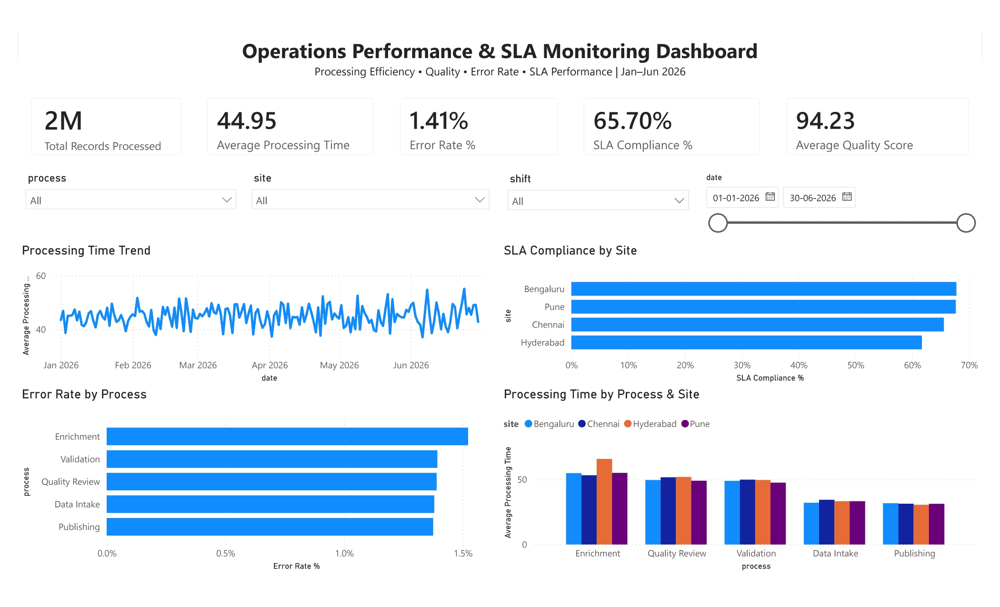

# Operations Performance & SLA Monitoring Dashboard

An interactive **Power BI operations analytics dashboard** built to monitor processing efficiency, service-level performance, error rates, and quality across multiple operational processes, sites, and shifts.

The project demonstrates an end-to-end analytics workflow involving data preparation, KPI development, DAX measures, interactive filtering, data visualization, and business insight generation.

## Dashboard Preview



## Project Objective

Operational teams need to monitor not only how much work is processed, but also whether that work is completed efficiently, accurately, and within defined service-level targets.

This project was designed to answer questions such as:

- How efficiently are records being processed over time?
- Which sites achieve the strongest SLA compliance?
- Which processes have the highest error rates?
- Where are processing bottlenecks occurring?
- How does operational performance vary across sites, processes, shifts, and time periods?

## Key Performance Indicators

The dashboard tracks five primary KPIs:

| KPI | Overall Result |
|---|---:|
| Total Records Processed | 2M |
| Average Processing Time | 44.95 |
| Error Rate | 1.41% |
| SLA Compliance | 65.70% |
| Average Quality Score | 94.23 |

All KPI cards respond dynamically to the dashboard filters.

## Dashboard Analysis

### Processing Time Trend
Tracks average processing time across the January–June 2026 period, allowing changes and unusual processing-time spikes to be identified.

### SLA Compliance by Site
Compares SLA performance across Bengaluru, Pune, Chennai, and Hyderabad.

### Error Rate by Process
Highlights differences in error rates across operational stages including Data Intake, Enrichment, Validation, Quality Review, and Publishing.

### Processing Time by Process & Site
Compares processing efficiency across both process and site dimensions, helping identify operational bottlenecks.

## Interactive Filters

The dashboard includes slicers for:

- Process
- Site
- Shift
- Date range

These filters interact with the KPI cards and analytical visuals, enabling detailed investigation of specific operational segments.

## Key Insights

- Overall SLA compliance is **65.70%**, indicating significant opportunity to improve adherence to service-level targets.
- **Enrichment** records the highest process-level error rate at approximately **1.5%**.
- Enrichment also shows the highest processing time among the major operational stages, making it a key candidate for process optimization.
- **Bengaluru and Pune** demonstrate stronger SLA performance than Chennai and Hyderabad.
- Overall quality remains high at **94.23**, despite comparatively weaker SLA performance.
- Site, process, shift, and date filtering enables bottlenecks to be investigated beyond organization-wide averages.

## DAX Measures

Custom measures were created to calculate dashboard KPIs dynamically.

Example — Error Rate:

```DAX
Error Rate % =
DIVIDE(
    SUM(operations_clean[errors_found]),
    SUM(operations_clean[records_processed]),
    0
) * 100
```

Additional measures calculate:

- Total Records Processed
- Average Processing Time
- Average Quality Score
- SLA Compliance %

## Tools & Skills Demonstrated

**Power BI**
- Interactive dashboard development
- KPI cards
- Slicers and cross-filtering
- Line and bar/column visualizations
- Visual formatting and report design

**DAX**
- Custom measures
- Aggregation
- Ratio calculations
- Filter-context-aware KPIs

**Data Analysis**
- Operational performance analysis
- SLA monitoring
- Error-rate analysis
- Bottleneck identification
- Site and process comparison
- Trend analysis

**Data Preparation**
- Data cleaning and validation
- Data type preparation
- Categorical standardization
- Analytical field preparation

## Repository Structure

```text
operations-performance-analytics/
│
├── operations-performance-sla-dashboard.pbix
│   └── Interactive Power BI dashboard
│
├── operations_clean.csv
│   └── Cleaned dataset used for analysis
│
├── oamp_page-0001.jpg
│   └── Dashboard preview
│
└── README.md
    └── Project documentation
```

## How to Explore the Dashboard

1. Download `operations-performance-sla-dashboard.pbix`.
2. Open the file using Power BI Desktop.
3. Use the Process, Site, Shift, and Date slicers to explore different operational segments.
4. Review changes in the KPI cards and visualizations as filters are applied.

## Business Recommendations

Based on the dashboard analysis:

1. **Prioritize Enrichment process improvement** due to its combination of higher processing time and error rate.
2. **Investigate SLA gaps at lower-performing sites** and compare their workflows with stronger-performing locations.
3. **Monitor processing-time spikes** to identify recurring operational bottlenecks.
4. Maintain the strong overall quality level while improving processing efficiency and SLA attainment.

---

### Project Summary

This project demonstrates how operational data can be transformed into an interactive monitoring solution that helps identify performance gaps, compare locations and processes, and support data-driven operational decisions.

**Built with Power BI, DAX, and data analytics techniques.**
