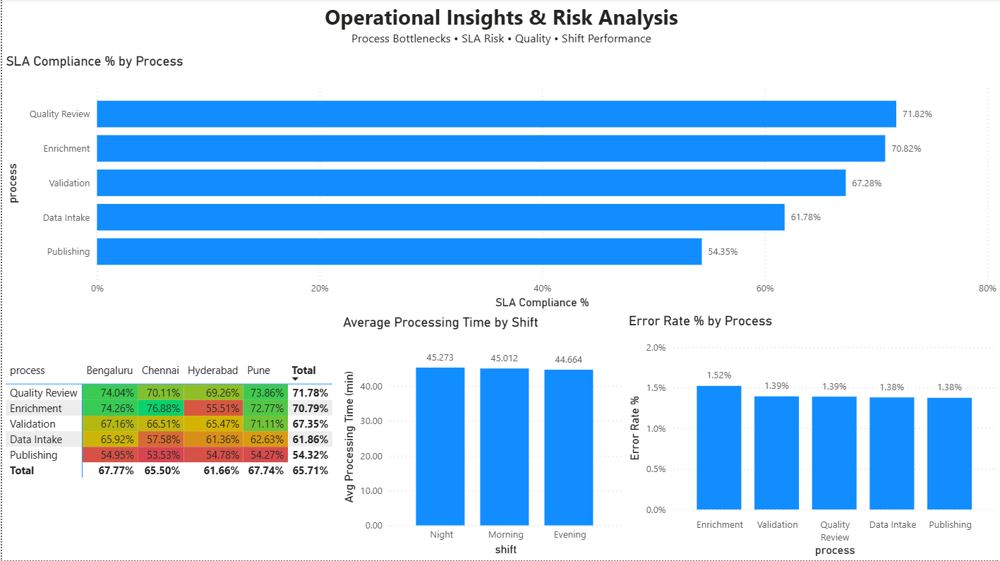

# Operations Performance & SLA Monitoring Dashboard

An interactive **two-page Power BI operations analytics dashboard** designed to monitor processing efficiency, service-level performance, error rates, data quality, and operational risk across multiple processes, sites, and shifts.

The project demonstrates an end-to-end analytics workflow involving **data preparation, KPI development, DAX measures, interactive filtering, conditional formatting, data visualization, and business insight generation**.

The report is divided into two analytical views:

- **Page 1 — Performance Overview:** Executive-level monitoring of operational KPIs, trends, site performance, and process efficiency.
- **Page 2 — Operational Insights & Risk Analysis:** Deeper investigation of SLA performance, site/process variation, quality risk, and shift-level processing performance.

---

## 📊 Dashboard Preview

### Page 1 — Performance Overview

Provides an executive overview of operational performance through KPI cards, interactive slicers, trend analysis, site-level SLA monitoring, and process-level performance comparisons.


### Page 2 — Operational Insights & Risk Analysis

Provides a deeper analytical view of SLA compliance, process/site performance, shift-level processing time, and operational error rates.



---

## 🎯 Project Objective

Operational teams need to monitor not only how much work is processed, but also whether that work is completed **efficiently, accurately, consistently, and within defined service-level targets**.

This project was designed to answer questions such as:

- How efficiently are records being processed over time?
- Which sites achieve the strongest SLA compliance?
- Which processes have the highest error rates?
- Where are processing bottlenecks occurring?
- Which processes consistently meet or miss SLA targets?
- How does SLA compliance vary across process and site combinations?
- Does processing performance vary significantly between shifts?
- How does operational performance vary across sites, processes, shifts, and time periods?

---

## 📌 Key Performance Indicators

The dashboard tracks five primary operational KPIs:

| KPI | Overall Result |
|---|---:|
| Total Records Processed | 2M |
| Average Processing Time | 44.95 min |
| Error Rate | 1.41% |
| SLA Compliance | 65.70% |
| Average Quality Score | 94.23 / 100 |

All KPI cards respond dynamically to the dashboard filters.

---

# 📈 Page 1 — Performance Overview

Page 1 provides a high-level view of overall operational performance and allows users to quickly identify trends, site-level differences, and process bottlenecks.

## Processing Time Trend

Tracks average processing time across the **January–June 2026** period.

This enables users to:

- Monitor processing efficiency over time
- Identify unusual processing-time spikes
- Detect periods requiring deeper investigation
- Compare operational stability across the reporting period

## SLA Compliance by Site

Compares SLA performance across:

- Bengaluru
- Pune
- Chennai
- Hyderabad

Bengaluru and Pune show stronger SLA performance, while Hyderabad records comparatively weaker compliance.

## Error Rate by Process

Compares operational error rates across:

- Data Intake
- Enrichment
- Validation
- Quality Review
- Publishing

**Enrichment records the highest process-level error rate at approximately 1.52%.**

## Processing Time by Process & Site

Compares average processing time across both process and site dimensions.

This provides a more detailed view of where operational bottlenecks may exist and helps determine whether performance issues are concentrated within a specific process, location, or combination of both.

---

# 🔍 Page 2 — Operational Insights & Risk Analysis

Page 2 extends the dashboard beyond executive monitoring and provides a deeper view of **SLA risk, process performance, site variation, shift performance, and operational quality**.

## SLA Compliance by Process

Compares SLA compliance across the major operational processes.

The visual makes it possible to identify which stages consistently perform well and which require additional operational attention.

The analysis shows noticeable variation between processes, indicating that SLA performance is not uniform across the operational workflow.

## Process × Site SLA Compliance Matrix

A matrix visual combines **process and site dimensions** to provide a granular view of SLA performance.

Conditional formatting allows stronger and weaker combinations to be identified quickly.

This enables investigation beyond organization-wide averages by answering questions such as:

- Is a weak process underperforming across all sites?
- Are SLA issues concentrated within specific locations?
- Which process-site combinations demonstrate stronger operational performance?

## Average Processing Time by Shift

Compares average processing time across:

- Night
- Morning
- Evening

Observed averages are approximately:

| Shift | Avg. Processing Time |
|---|---:|
| Night | 45.273 min |
| Morning | 45.012 min |
| Evening | 44.664 min |

The relatively small variation indicates that **processing performance remains broadly consistent across shifts**, suggesting that shift assignment is unlikely to be the primary driver of overall processing-time bottlenecks.

## Error Rate by Process

Provides a focused quality-risk view of the operational workflow.

Approximate process-level error rates include:

| Process | Error Rate |
|---|---:|
| Enrichment | 1.52% |
| Validation | 1.42% |
| Publishing | 1.41% |
| Quality Review | 1.36% |
| Data Intake | 1.34% |

Enrichment has the highest error rate, reinforcing it as an important candidate for further process investigation.

---

## 🎛️ Interactive Filters

The dashboard includes slicers for:

- **Process**
- **Site**
- **Shift**
- **Date range**

These filters interact with KPI cards and analytical visuals, enabling users to investigate specific operational segments rather than relying solely on overall averages.

For example, users can isolate a specific process and site combination and observe how processing time, error rate, SLA compliance, and quality performance respond.

---

## 💡 Key Insights

### 1. SLA performance represents the largest operational opportunity

Overall SLA compliance is **65.70%**, indicating significant scope for improvement in meeting service-level targets.

### 2. Enrichment represents a key operational risk area

Enrichment records the **highest process-level error rate at approximately 1.52%** and also demonstrates comparatively high processing time.

This combination makes Enrichment an important candidate for root-cause analysis and process optimization.

### 3. Site-level SLA performance varies

**Bengaluru and Pune** demonstrate stronger SLA performance than Chennai and Hyderabad.

This suggests that comparing workflows, staffing patterns, or process execution between higher- and lower-performing sites may reveal opportunities for improvement.

### 4. Quality remains strong despite weaker SLA attainment

The overall quality score remains high at approximately **94.23 / 100**, despite SLA compliance of 65.70%.

This suggests that the primary operational challenge may relate more to **timeliness and processing efficiency** than severe deterioration in output quality.

### 5. Shift performance is relatively stable

Average processing time varies only slightly across Night, Morning, and Evening shifts.

This indicates that shift timing alone is unlikely to explain major operational bottlenecks.

### 6. Process-site analysis provides more actionable insight than overall averages

The Process × Site SLA matrix reveals variation that can be hidden when only organization-wide metrics are considered.

This enables operational teams to focus improvement initiatives on specific combinations rather than applying broad interventions.

---

## 🧮 DAX Measures

Custom DAX measures were created to calculate dashboard KPIs dynamically and respond to filter context.

### Error Rate

```DAX
Error Rate % =
DIVIDE(
    SUM(operations_clean[errors_found]),
    SUM(operations_clean[records_processed]),
    0
) * 100
